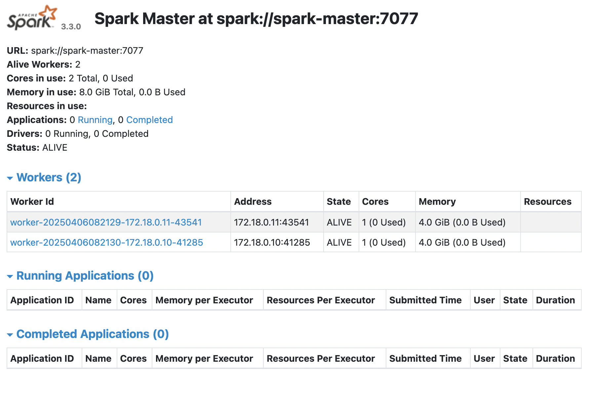
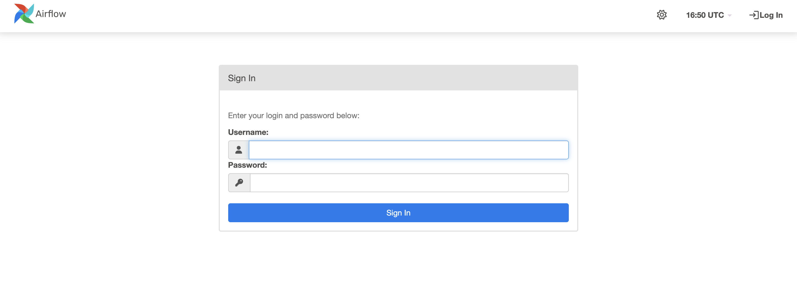
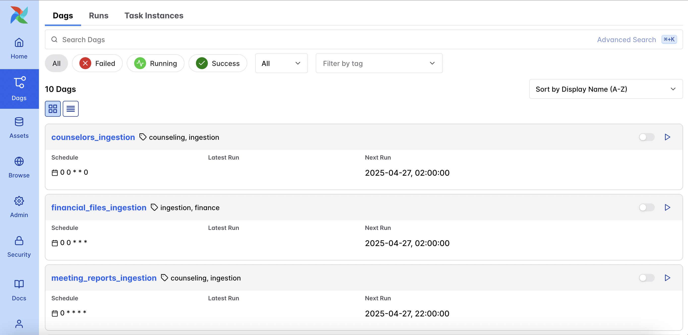
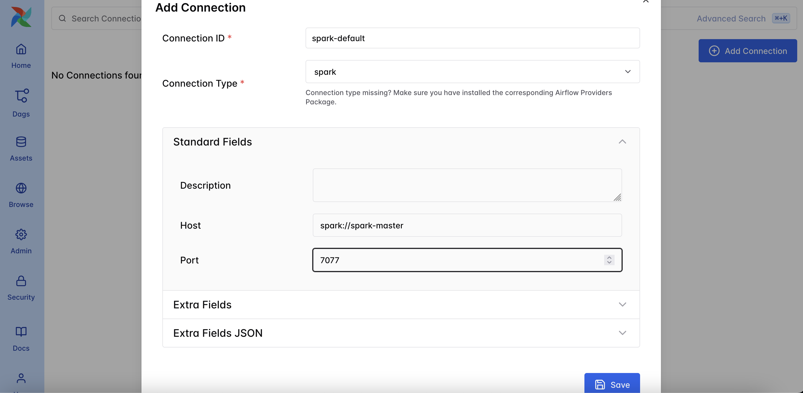
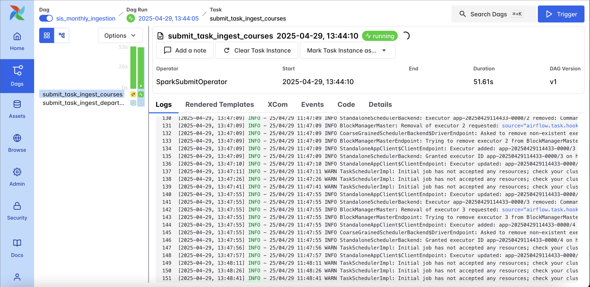

# Project part 1 - Landing Zone

## Cloning the repository

```bash
git clone https://github.com/nhungoc1508/S25-BDM-Project.git
```

## Setting up the data simulation container
```bash
cd S25-BDM-Project
cd data-simulation
docker network create data-processing-network
docker compose up postgres_sis mongodb fastapi_counselor_data financial-data -d
```

Check that the PostgreSQL server is running and data has been loaded:
```bash
docker logs postgres_sis | grep "Mock data"
```
Should see either `Mock data inserted successfully!` or `Mock data already exists. Skipping insertion.`

Check that the MongoDB server is running and data has been loaded:
```bash
docker logs mongo_counselors | grep "Mock data"
```
Should see `Mock data inserted successfully!`

Now, you can safely run the meeting request/report generator (which depends on the PostgreSQL server and the MongoDB collections):
```bash
docker compose up meeting-request-generator -d
```

## Setting up Delta Lake and the ingestion pipeline

> [!IMPORTANT]
> If you are running locally, **comment out** this line in the `docker-compose.yaml` file (this line appears 3 times under `spark-master`, `spark-worker-1`, and `spark-worker-2`): `platform: linux/arm64`

### Setting up Spark master and workers
Initial build:
```bash
cd ../delta-lake
docker compose build --no-cache
```
Start master:
```bash
docker compose up spark-master -d
```
Check that master is running:
```bash
docker logs spark-master | grep "I have been elected leader! New state: ALIVE"
```
Start workers:
```bash
docker compose up spark-worker-1 spark-worker-2 -d
```
Check that all nodes are running and the workers are registered with master:
```bash
docker logs spark-worker-1 | grep "Successfully registered with master spark://spark-master:7077"
docker logs spark-worker-2 | grep "Successfully registered with master spark://spark-master:7077"
```
In case of failure to register, run `compose down` then repeat previous steps:
```bash
docker compose down spark-master spark-worker-1 spark-worker-2 -v
```
Once running, the Spark master UI is available at `localhost:8081/` and will show 2 alive workers:
<center></center>

### Setting up Airflow
```bash
mkdir -p ./data ./logs ./plugins ./config
echo -e "AIRFLOW_UID=$(id -u)" > .env

docker compose up airflow-init
```
Check that Airflow is using PostgreSQL for metadata (and not SQLite):
```bash
docker logs airflow-init | grep "DB: postgresql+psycopg2"
```
Start the rest of the Airflow-related services:
<!-- docker compose up -d -->
```bash
docker compose up airflow-worker airflow-scheduler airflow-dag-processor airflow-apiserver airflow-triggerer airflow-cli flower -d
```
Check that the webserver UI is up and running:
```bash
docker logs airflow-apiserver | grep "Application startup complete"
```
The Airflow webserver is available at `localhost:8080/`:
<center></center>

Log in with username `airflow` and password `airflow`. After logging in, click on the **Dags** tab on the left menu bar, the webserver UI will list all available DAGs:

<center></center>

<!-- ```bash
data/landing/temporal
├── counselor_api
│   ├── date=2025-04-04
│   └── date=2025-04-05
├── meeting_reports
│   └── date=2025-04-05
├── meeting_requests
│   ├── _delta_log
│   ├── date=2025-04-05
│   └── date=2025-04-04
├── sis_students
│   └── date=2025-04-04
...
```

```bash
data/landing/temporal/counselor_api
├── date=2025-04-04
│   └── batch=0a7e50a0-61d7-4a93-89c8-c3a16a96007a
│       ├── _delta_log
│       │   └── 00000000000000000000.json
│       └── part-00000-b9d81c11-652c-48b7-9a94-95a92aa7acda-c000.snappy.parquet
└── date=2025-04-05
    ├── batch=2b1f8e56-8a84-47d0-b3c5-3345a9493787
    │   ├── _delta_log
    │   │   └── 00000000000000000000.json
    │   └── part-00000-e6e35d1b-fb24-42c8-a34c-d2de416a9534-c000.snappy.parquet
    └── batch=520cb403-cdd4-4705-b7c6-fbf9416bd8a2
        ├── _delta_log
        │   └── 00000000000000000000.json
        └── part-00000-af81db70-e3dc-4e7f-9784-e3094f827cd4-c000.snappy.parquet
``` -->

## Running DAGs to submit Spark ingestion jobs

### Setting up connection to Spark master

In the Airflow webserver UI, go to **Admin** > **Connections**. Select **Add Connection** and add a connection to the Spark master with ID `spark-default`, type `Spark`, host `spark://spark-master`, and port `7077`:

<center></center>


### Running DAGs
Either trigger the DAGs manually or wait for scheduled runs, and monitor the DAG logs:
<center></center>